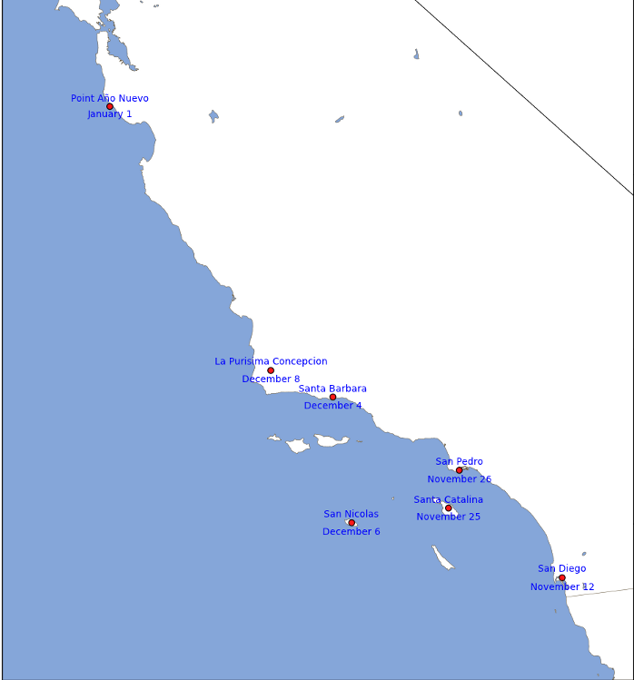

On the Toponomy of the Coast of California
##########################################

:date: 2012-02-04
:lang: en
:author: Alejandro Weinstein

San Diego, Santa Catalina, San Pedro, where all these names come from? I
learned about it reading `“The Quark and the Jaguar: Adventures in the Simple
and the Complex”
<http://www.amazon.com/Quark-Jaguar-Adventures-Simple-Complex/dp/0716727250>`_
by Murray Gell-Man. In 1602 `Sebastian Vizcaino
<http://en.wikipedia.org/wiki/Sebasti%C3%A1n_Vizca%C3%ADno>`_ was given the
mandate to map the coast of California. For each new place he found, he looked
at the `calendar of the saints
<http://en.wikipedia.org/wiki/Calendar_of_saints>`_ and used the name
corresponding to the discovery date to name it. So when he discovered a new
place on November 12, he looked at the calendar, and he decided to call the
place San Diego, since that was the day `Saint Didacus of Alcalá <http://en.wikipedia.org/wiki/Didacus_of_Alcal%C3%A1>`_, also known as Saint Diego, died.

As he moved north, he followed the same recipe for naming places. The following map shows some of the places he mapped with their corresponding discovery dates. Note that he discovered “Point Año Nuevo” on January 1st. Since “Año Nuevo” is new year in Spanish, it makes perfect sense.

